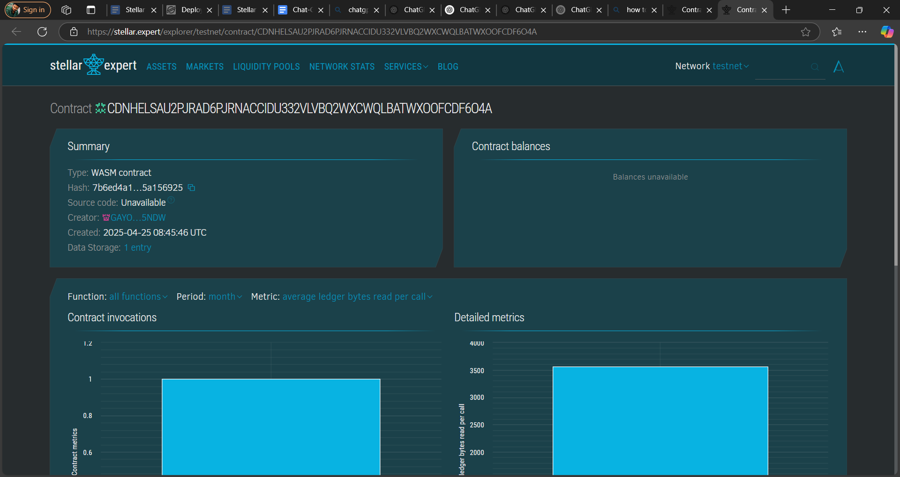

# On Demand Parking Reservation Website

## 🚗 Project Title
**On Demand Parking Reservation Website**

---

## 🧾 Project Description

This smart contract powers a decentralized system for reserving parking spots on-demand. It ensures secure, timestamped, and tamper-proof booking records on the blockchain, enabling users to reserve parking spaces in real-time across different locations.

---

## 🔭 Project Vision

To build a trustless and transparent platform where users can reserve, verify, and manage parking spots seamlessly, reducing congestion and wait times in urban environments.

---

## 🌟 Key Features

- 🕒 **Real-Time Reservation**: Instantly reserve a parking spot with location and duration.
- 🔍 **Reservation Lookup**: View the details of a reservation using a unique reservation ID.
- ⛔ **Expire Bookings**: Automatically or manually mark expired reservations to free up slots.
- 📊 **Immutable Data**: Reservations stored on blockchain, ensuring authenticity.

---

## 🚀 Future Scope

- 📍 **GPS-based Auto Expiry**: Auto-expire reservations when cars leave the geofence.
- 💳 **Integrated Payments**: Add native token support for reservation fees.
- 🎫 **Permit-based Access**: Assign access levels for premium or restricted zones.
- 📱 **Mobile Integration**: Integrate with a dApp/mobile app for real-time booking and alerts.

---
## Contract Details
CDNHELSAU2PJRAD6PJRNACCIDU332VLVBQ2WXCWQLBATWXOOFCDF6O4A
